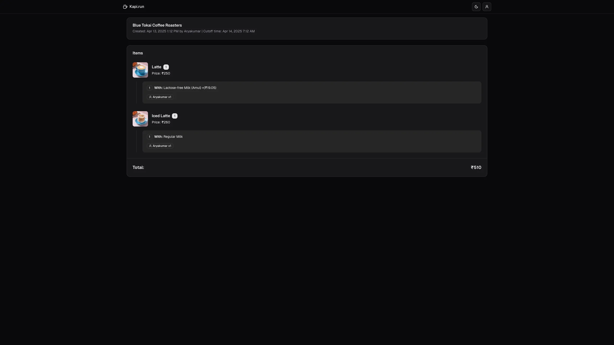

# kapi.run

A collaborative food ordering coordination tool that simplifies group orders in office environments. Perfect for managing coffee runs and team snack orders without the hassle of manual coordination.

## Quick Access

- **Hosted Version**: Visit [kapi.run](https://kapi.run) to start using the platform immediately without any setup
- **Self Hosting**: Follow the setup instructions below to host your own instance

## What Problem Does It Solve?

In many offices, one person typically takes responsibility for collecting and placing group food/beverage orders. This process usually involves:

1. Manually collecting orders from colleagues
2. Keeping track of individual customizations
3. Managing order cutoff times
4. Consolidating everything into a single order

kapi.run streamlines this process by:

1. Allowing the order coordinator to create a shareable ordering session
2. Setting clear cutoff times for order submissions
3. Enabling team members to add their own items with customizations
4. Providing a consolidated view of all orders for easy checkout

## Key Features

- 🔗 Shareable session links for easy collaboration
- ⏰ Customizable order cutoff times
- 🛒 Real-time cart updates
- 🔄 Item customization support
- 👥 Multiple participants per session
- 📱 Mobile-friendly interface
- 🌙 Dark/Light mode support

## How It Works

1. **Session Creation**

   - Order coordinator selects a restaurant
   - Sets a cutoff time for orders
   - Gets a shareable link

2. **Order Collection**

   - Team members open the shared link
   - Add their items with customizations
   - Submit their selections

3. **Order Placement**
   - Coordinator reviews the consolidated cart
   - Ensures all items are correct
   - Places the final order through the actual delivery platform

## Screenshots

### Homepage - Create a New Session


_Create a new ordering session and set the cutoff time_

### Active Session View


_Participants can browse the menu and add items with customizations_

### Orders Dashboard


_Coordinator can view all items added by participants in one place_

## Tech Stack

- 🚀 Next.js 15 for the frontend and API routes
- 💾 PostgreSQL with Prisma for data persistence
- 🎨 Tailwind CSS & Shadcn UI for the interface
- 🔄 Real-time updates using React Server Components
- 🐳 Docker support for easy development and deployment

## Quick Start

1. **Clone and Install**

   ```bash
   git clone https://github.com/yourusername/kapi.run.git
   cd kapi.run
   bun install   # or npm install
   ```

2. **Set up Environment**

   ```bash
   cp .env.example .env
   ```

3. **Start Development Environment**

   ```bash
   # Start PostgreSQL database
   docker-compose -f docker-compose.dev.yml up -d

   # Run database migrations
   bunx prisma migrate dev

   # Start development server
   bun run dev
   ```

Visit `http://localhost:3000` to see the app running.

## Database Schema

The project uses Prisma ORM with PostgreSQL. Key models include:

- Sessions (for order coordination)
- Items (menu items with variations)
- UserSessions (tracking participants)
- CartItems (items added by participants)

## Contributing

Contributions are welcome! Please feel free to submit a Pull Request.

## License

MIT License - feel free to use this for your own office's order management needs!
